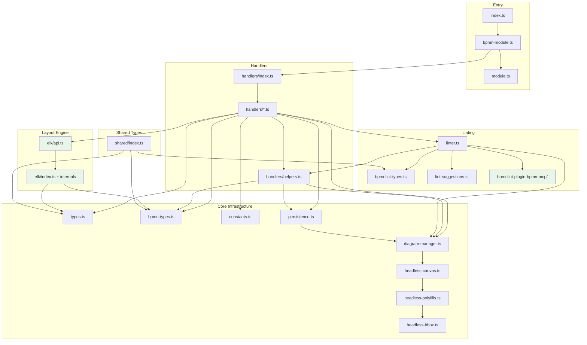

# Architecture

## Overview

BPMN-MCP is a Model Context Protocol (MCP) server that lets AI assistants create and manipulate BPMN 2.0 workflow diagrams. It uses `bpmn-js` running headlessly via `jsdom` to produce valid BPMN XML and SVG output.

## Module Dependency Diagram



## Module Boundaries

The project enforces strict dependency boundaries (via ESLint `no-restricted-imports`):

| Module                          | May import from                                      | Must NOT import from                     |
| ------------------------------- | ---------------------------------------------------- | ---------------------------------------- |
| `src/elk/`                      | `types.ts`, `bpmn-types.ts`, `constants.ts`, `elkjs` | `handlers/`, `bpmnlint-plugin-bpmn-mcp/` |
| `src/bpmnlint-plugin-bpmn-mcp/` | `bpmnlint`                                           | `handlers/`, `elk/`                      |
| `src/handlers/`                 | Everything above                                     | _(no restrictions)_                      |

These rules keep `elk/` and `bpmnlint-plugin-bpmn-mcp/` as independent leaf modules that can be extracted into separate packages if needed.

## Dependency Flow

```
Allowed dependency direction: top → bottom

  index.ts / bpmn-module.ts
           │
    handlers/index.ts
           │
    handlers/*.ts
      │    │    │
      │    │    └──► elk/api.ts ──► elk/ internals
      │    │
      │    └──► linter.ts ──► bpmnlint-plugin-bpmn-mcp/
      │
      └──► diagram-manager.ts ──► headless-canvas.ts
```

## Directory Layout

| Directory / File                | Responsibility                                                   |
| ------------------------------- | ---------------------------------------------------------------- |
| `src/index.ts`                  | Entry point — wires MCP server, transport, and tool modules      |
| `src/module.ts`                 | Generic `ToolModule` interface for pluggable editor back-ends    |
| `src/bpmn-module.ts`            | BPMN tool module — registers tools and dispatches calls          |
| `src/types.ts`                  | Shared interfaces (`DiagramState`, `ToolResult`, arg types)      |
| `src/bpmn-types.ts`             | TypeScript interfaces for bpmn-js services                       |
| `src/constants.ts`              | Centralised magic numbers (`STANDARD_BPMN_GAP`, `ELEMENT_SIZES`) |
| `src/headless-canvas.ts`        | jsdom setup, lazy `BpmnModeler` init                             |
| `src/headless-polyfills.ts`     | SVG/CSS polyfills for headless bpmn-js                           |
| `src/headless-bbox.ts`          | Element-type-aware bounding box estimation                       |
| `src/headless-path.ts`          | SVG path `d` attribute parser                                    |
| `src/diagram-manager.ts`        | In-memory `Map<string, DiagramState>` store                      |
| `src/linter.ts`                 | Centralised bpmnlint integration                                 |
| `src/lint-suggestions.ts`       | Fix suggestion generation for lint issues                        |
| `src/bpmnlint-types.ts`         | TypeScript types for bpmnlint                                    |
| `src/persistence.ts`            | Optional file-backed diagram persistence                         |
| `src/tool-definitions.ts`       | Thin re-export of TOOL_DEFINITIONS                               |
| `src/shared/index.ts`           | Cross-cutting type re-export barrel                              |
| `src/handlers/`                 | One handler file per MCP tool (34 tools)                         |
| `src/handlers/index.ts`         | Tool registry + dispatch map + re-exports                        |
| `src/handlers/helpers.ts`       | Shared utilities barrel (validation, element access, etc.)       |
| `src/elk/`                      | ELK-based auto-layout engine (Sugiyama layered algorithm)        |
| `src/elk/api.ts`                | Public API: `elkLayout`, `elkLayoutSubset`                       |
| `src/bpmnlint-plugin-bpmn-mcp/` | Custom bpmnlint plugin with Camunda 7 rules                      |

## Where to Put New Code

```
Need to add…                         → Put it in…
─────────────────────────────────────────────────────────────────
A new MCP tool                       → src/handlers/<name>.ts
                                       (export handler + TOOL_DEFINITION,
                                        add to TOOL_REGISTRY in index.ts)

A shared handler utility             → src/handlers/helpers.ts barrel
                                       (or a new sub-module re-exported from it)

A new bpmnlint rule                  → src/bpmnlint-plugin-bpmn-mcp/rules/

A layout algorithm improvement       → src/elk/ (keep behind elk/api.ts)

A new bpmn-js type/interface         → src/bpmn-types.ts

A new shared constant                → src/constants.ts

A polyfill for headless bpmn-js      → src/headless-polyfills.ts
                                       or src/headless-bbox.ts

Cross-cutting types needed by tests  → src/shared/index.ts (re-export barrel)
```

## Core Patterns

1. **Headless bpmn-js via jsdom** — A shared `jsdom` instance polyfills browser APIs so `bpmn-js` can run in Node.js without a browser.

2. **In-memory diagram store** — Diagrams live in a `Map<string, DiagramState>` keyed by generated IDs. Optional file-backed persistence can be enabled.

3. **Co-located tool definitions** — Each handler file exports both the handler function and its `TOOL_DEFINITION` schema, preventing definition drift (see [ADR-001](../agents/adrs/ADR-001-co-located-tool-definitions.md)).

4. **Unified tool registry** — The `TOOL_REGISTRY` array in `src/handlers/index.ts` is the single source of truth. Both `TOOL_DEFINITIONS` and the dispatch map are auto-derived from it.

5. **Camunda moddle extension** — `camunda-bpmn-moddle` is registered on every modeler instance, enabling Camunda-specific attributes.

6. **Implicit lint feedback** — Mutating handlers call `appendLintFeedback()` to surface error-level lint issues in their response.

7. **Export lint gate** — `export_bpmn` blocks export when error-level lint issues exist, unless `skipLint: true` is passed.

8. **ELK auto-layout** — The `elkjs` Sugiyama layered algorithm provides automatic diagram arrangement via an 8-step pipeline: boundary save/restore, ELK graph building and layout, position application, boundary chain handling, artifact positioning, and label adjustment. Edge routing is delegated to bpmn-js's built-in ManhattanLayout.

9. **Label adjustment** — Geometry-based scoring positions external labels away from connection paths to reduce visual overlap.
